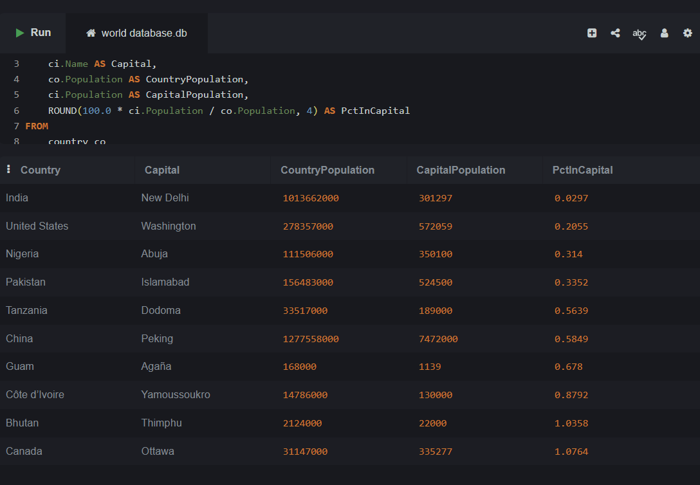

# Task 3 — Countries with the smallest share of population in the capital

## Explanation

This query:
1. JOINs `country` and `city` tables on the `Capital` column (ID of the capital city)
2. Calculates the percentage: `(CapitalPopulation / CountryPopulation) × 100`
3. Filters countries with non-zero population
4. Sorts by percentage in ascending order to find countries where the capital represents the smallest share
5. Returns the top 10

**Key Insight:** Large countries (India, USA, China, Nigeria) have capitals with relatively small shares of the national population because the country's population is widely distributed across many cities.

**Database:** world (SQLite)  
**Tables:** country, city

