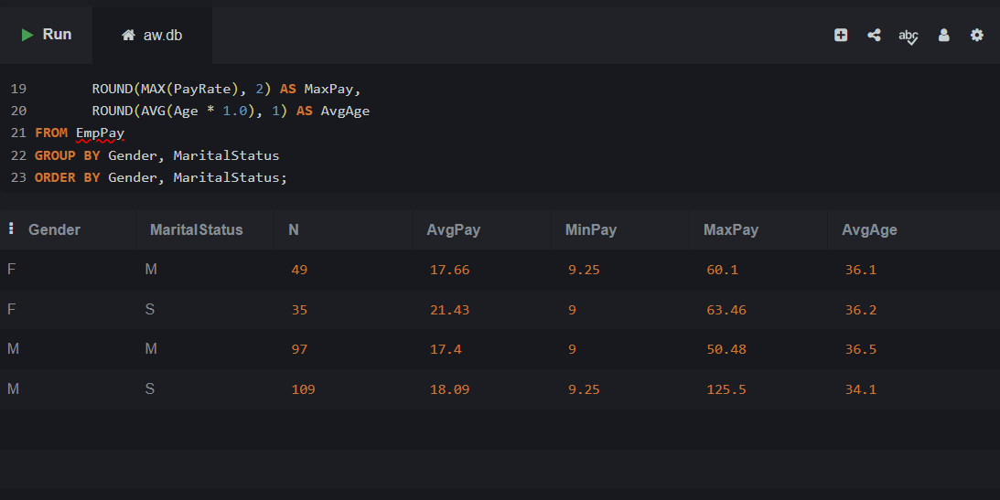
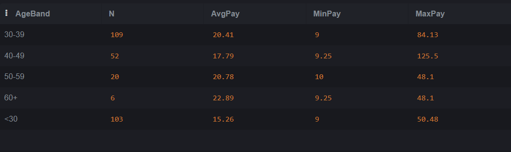
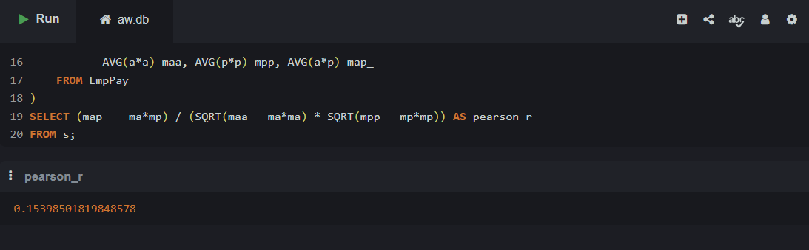
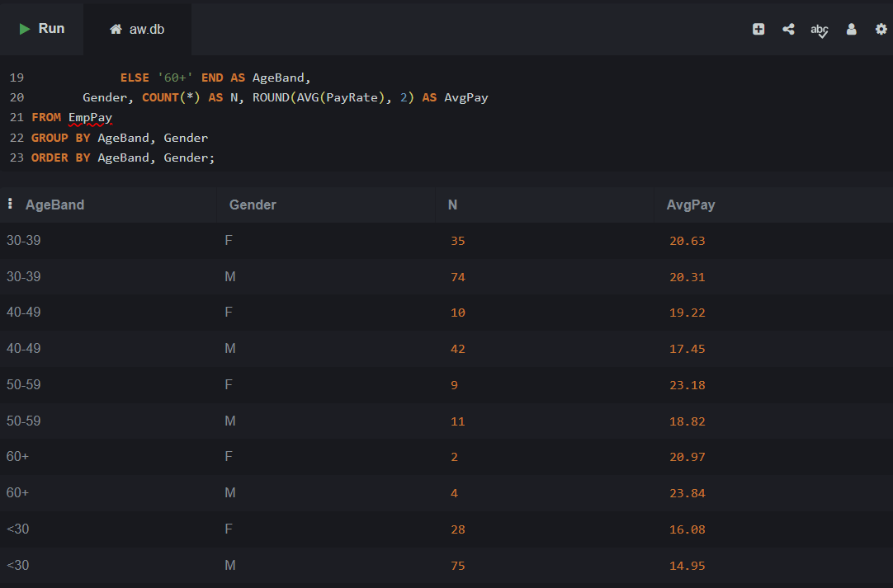

# Task 9 - Pay rate vs age, gender, marital status

## Part 9a - Group means by Gender × MaritalStatus



## Part 9b - By age band



## Part 9c - Pearson correlation: age vs pay



**Interpretation:**
- **r > 0** → Positive correlation: Older employees tend to earn more (experience premium)
- **r < 0** → Negative correlation: Older employees earn less (unusual; possible age bias)
- **r ≈ 0** → No correlation: Age doesn't predict pay


## Part 9d - Marginal effect of gender (controlling for age band)



**Result:** Pay by gender within each age band-reveals whether gender pay gaps exist at each career stage.


## Key Techniques

### Getting Current Pay
```sql
ROW_NUMBER() OVER (PARTITION BY BusinessEntityID ORDER BY RateChangeDate DESC) AS rn
```
- Ranks pay history records per employee (most recent = rn=1)
- JOINs back with `rn = 1` to get current rate only

### Age Calculation (as of 2014-06-30)
```sql
CAST((julianday('2014-06-30') - julianday(BirthDate)) / 365.25 AS INTEGER) AS Age
```
- Uses Julian day numbers for date arithmetic
- Divides by 365.25 (accounting for leap years)
- CASTs to INTEGER for bucketing

## Insights to Look For

1. **Pay progression** - Does each age band earn notably more?
2. **Gender differences** - Within-band gaps or overall?
3. **Marital status** - Do married/single employees differ in pay?
4. **Distribution** - Is range (min–max) similar across groups?

**Database:** AdventureWorks (OLTP)  
**Tables:** Employee, EmployeePayHistory

